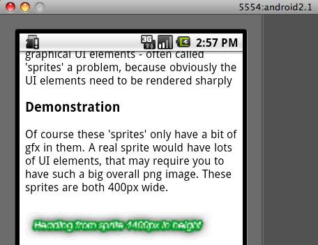

Recently I completed some UI intensive work for a client that was designed for smart-phones. The project was targeted at iPhone and Android users primarily and being web based, made heavy use of CSS3 and HTML5 to achieve the desired highly graphical user interface.

During the course of the project we noticed that some Android phones were rendering our graphics very poorly, as shown in this screenshot of the Android emulator:

### 

We traced the problem to our use of CSS background image sprites. If you're having the same problem and are just looking for a quick fix then check out [our solution](#android-css-solution "Solution to the android css background blur problem") below. If you're curious about the details, read on.

CSS background sprites are large-ish png files (or jpg and gif if you don't need the alpha channel) that contain all the small UI elements for your project. Using the sprite method means that your users have a faster download experience overall, because they don't experience the equivalent of 2-3k overhead that comes with each individual server request. When your sprite replaces 100 or so very small UI images then that can result in a 2-300k saving - which is a big deal when your users are accessing your project over a 3G network.

Therefore changing our approach to use individual graphics over sprites was not an option. This meant that the problem had to be solved, somehow.

### Exactly which Android versions/phones are affected?

First task was to identify what phones were showing the issue. If it was only apparent on early versions of Android (pre 2.1) then we could probably ignore the issue.

*   The Android emulator shows the issue for 1.5, 1.6, 2.1 and 2.2
*   A Samsung Galaxy running Android 2.2 **didn't** show the issue
*   The client reported that a HTC phone (I didn't ask about the exact model) running Android 2.2 did show the issue

The project used a couple of images in addition to the sprites, such as the company logo, that were rendering fine. So with that glimmer of hope and the fact that at least one modern phone was displaying the graphics sharply meant that there should be a solution to the issue.

### What does the blogosphere say?

JFGI is my mother-in-law's favourite saying, and just googling it is also my favourite bug fixing approach. Usually someone else has had any problem before you. However in this case I couldn't find anything specific, partly because searching for keywords such as "Android CSS background sprite blurry problem" generally results in thousands of pages about how to make a CSS file for smart phones and or why pictures of someone's dog is out of focus.

One thing I did find was that photographers had discovered that very big images did not load so well on Android phones. Reluctantly, I put aside the question of why you would want to show big images to users with a small screen, as this report did give me a clue as to what might be happening. As far as I could work out, at some unknown file size, the Android browser loads a highly compressed version of the image. So perhaps if I made my sprites more optimised and hence smaller then the problem would vanish.

### How big do the images need to be cause the issue?

Hang on a second, but my sprite file was already optimised within an inch of it's life. I was quite proud of my efforts in squeezing 100 or so UI elements into a 1700px by 400px png24 that resulting in a file size of only 73kb.

Nonetheless I tried hiding the elements layer by layer in the Photoshop file and retesting the resulting png with no result. Even when I got the sprite file down to one graphic element and a mere 10kb in file size - I still got the horrible Android blur that I had by this time come to despise.  

### A solution... but not an explanation

What saved me from insanity was that the logo and a footer graphic were rendering perfectly on each Android version I tested. Finally I had the idea that the way around the issue may not be to reduce the file _size_ but instead to reduce the image file _dimensions_ instead. With the benefit of hindsight it does feel as though I should have figured this out earlier.

Sure enough, when I cropped the sprite graphic a mere 400 pixels so that it measured 1300px by 400px the problem disappeared. I couldn't squeeze all my little graphics into that canvas size so I was forced to create two sprites instead. Not a big deal as it allowed me to split the load for the user so that they downloaded a subset og the UI only when they reached a point in the process where they actually needed those elements.

Further tests showed that if the canvas size was increased slightly to 1400px high by 400px wide then the blurriness appears again. See it for yourself by pointing your Android phone or emulator to:

*   [Demonstration of the Android CSS Background image blurriness issue](http://mbudm.com/experiments/android-css-bg/ "Demonstration of the Android CSS background image blurriness problem")

For curiosity I tried other dimensions such as 1500px by 300px or 800px by 600px and with both of these the blurriness also does not occur. So the obvious conclusion is that **Android does not render sharply any CSS background images that have a canvas size greater 520,000 - 560,000 pixels** (approximately).

Why is this so? Your guess is as good as mine...
