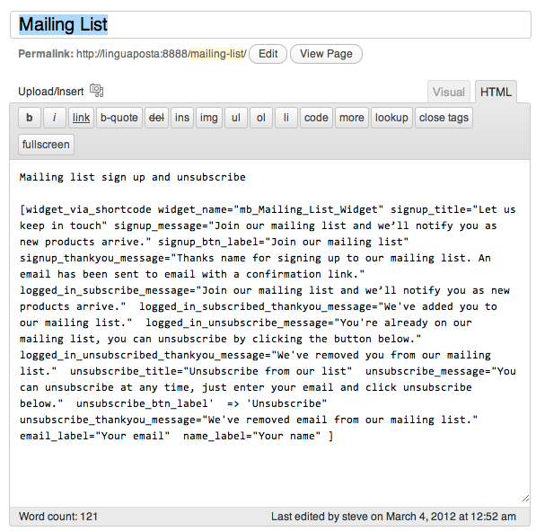
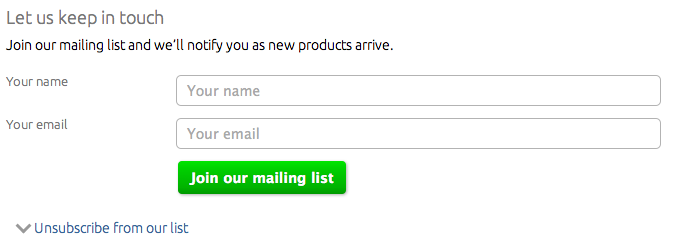
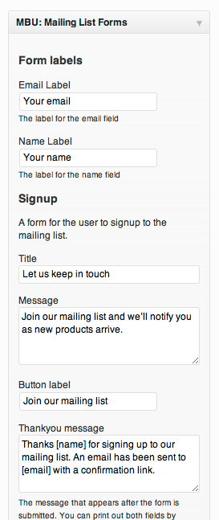
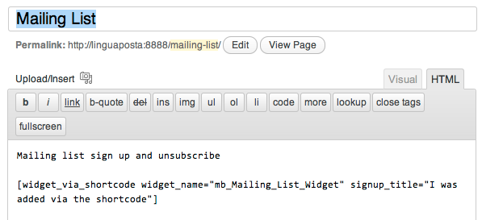
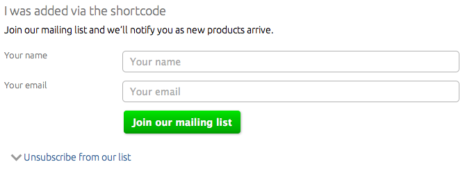

I'm loving working with WordPress because the development community is so large that it seems that no matter what obscure customisation you wan to achieve there is usually someone out there who has tried it and blogged about it.

Take the problem of adding widgets to a page or post via a shortcode. This is covered in this [blog post](http://digwp.com/2010/04/call-widget-with-shortcode/). There a couple of errors in that code that I've fixed, specifically some unexplained variables, and some better naming conventions:

```
/* Embed a widget in a page via a shortcode

Usage: [widget_via_shortcode widget_name="your_Widget_Class_Name" widget_option_one="Your value for widget option one" ]

*/
function widget_via_shortcode_parser( $atts, $content = null ){
	global $wp_widget_factory;

    extract(shortcode_atts(array(
        'widget_name' => FALSE
    ), $atts));

    $widget_name = wp_specialchars($widget_name);

    if (!is_a($wp_widget_factory->widgets[$widget_name], 'WP_Widget')):
        $wp_class = 'WP_Widget_'.ucwords(strtolower($widget_name));

        if (!is_a($wp_widget_factory->widgets[$wp_class], 'WP_Widget')):
            return '

'.sprintf(__("%s: Widget class not found. Make sure this widget exists and the class name is correct"),'**'.$widget_name.'**').'

';
        else:
            $widget_name = $wp_class;
        endif;
    endif;

	ob_start();
	the_widget($widget_name, $atts, null );
	$output .= ob_get_contents();
	ob_end_clean();
	return $output;
}
add_shortcode( 'widget_via_shortcode', 'widget_via_shortcode_parser' );


```

The problem I have with the above approach is that it requires you to specify every widget option in the short code. If you have a widget with lots of options, like my Mailing List forms widget, then you'd need to write a shortcode like this:



In order to get the widget to display like:



Rather than like this empty bit of code:


Pretty unwieldy! It would be much better to allow the use of the default options like when you add a widget in the normal way via the widgets GUI:



The problem is that in the widget class template the values that are used as default otpions in the widget forms() method are not accessible from our widget\_via\_shortcode\_parser function in functions.php. This is because they are not stored as class variables, instead they are just declared in the form() method, before the form is printed out to the widgets screen. Here is the default usage for the form() method as [demonstrated in the codex](http://codex.wordpress.org/Widgets_API#Default_Usage). A default value is give for the title in a variable called $title:

```
	public function form( $instance ) {
		if ( $instance ) {
			$title = esc_attr( $instance[ 'title' ] );
		}
		else {
			$title = __( 'New title', 'text_domain' );
		}
		?>
		

		 
		
		

		

So with my widgets I have deviated slightly form the norm by adding a  class variable called defaults that is an array of all default values for the widget settings. Firstly, declare the class variable and then add the default values in the constructor function:

```

class mb_Mailing_List_Widget extends WP_Widget {

	 var $defaults; /* store all the default values so that they are accessible form outside the class */

		function mb_Mailing_List_Widget() {
		/* Widget settings. */
		$widget_ops = array( 'classname' => 'widget_mb_mailing_list', 'description' => esc_html__("A widget for subscribing/unsubscribing to a mailing list.", 'mbudm') );

		/* Widget control settings. */
		$control_ops = array( 'width' => 150, 'height' => 350, 'id_base' => 'mb-mailing-list-widget' );

		/* Create the widget. */
		$this->WP_Widget( 'mb-mailing-list-widget', esc_html__('MBU: Mailing List Forms', 'mbudm'), $widget_ops, $control_ops );
		
		$this->defaults = array( 
		'signup_title' => 'Let us keep in touch', 
		'signup_message' => 'Join our mailing list and we’ll notify you as new products arrive.',
		'signup_btn_label' => 'Join our mailing list',
		'signup_thankyou_message' => 'Thanks [name] for signing up to our mailing list. An email has been sent to [email] with a confirmation link.',
		'logged_in_subscribe_message' => 'Join our mailing list and we’ll notify you as new products arrive.',
		'logged_in_subscribed_thankyou_message' => 'We've added you to our mailing list.',
		'logged_in_unsubscribe_message' => 'You're already on our mailing list, you can unsubscribe by clicking the button below.',
		'logged_in_unsubscribed_thankyou_message' => 'We've removed you from our mailing list.',
		'unsubscribe_title' => 'Unsubscribe from our list',
		'unsubscribe_message' => 'You can unsubscribe at any time, just enter your email and click unsubscribe below.',
		'unsubscribe_btn_label'  => 'Unsubscribe',
		'unsubscribe_thankyou_message' => 'We've removed [email] from our mailing list.',
		'email_label'  => 'Your email',
		'name_label'  => 'Your name'
		);
	}


```

Then in the form function, it's just a matter of using the class variable rather than the local variable:

```
function form( $instance ) {

		$instance = wp_parse_args( (array) $instance, $this->defaults ); 


```

Now the final step is to grab these defaults out of our widget class (that is handily stored in the $wp_widget_factory global instance) and replace any of the defaults with attributes that were added to the shortcode. This is best done just before  we call the_widget():

```
    /* use the widget defaults, if they are accessible. Override any defaults with an equivalent attribute that was added to the shortcode */
    if(is_array($wp_widget_factory->widgets[$widget_name]->defaults) ){
    	$combined_atts = array_merge($wp_widget_factory->widgets[$widget_name]->defaults,$atts);
    }else{
    	$combined_atts = $atts;
    }
    
	ob_start();
	the_widget($widget_name, $combined_atts, null );

```

Now I can test this by adding a shortcode with just one of the widget settings added:



To produce a widget that combines the defaults with my customisation added via the shortcode:



Of course this method will not work with any of the default WordPress widgets as they have not been modified to make the default widget settings accessible. However these can still be used with this widget_via_shortcode_parser function as long as all the widget settings are included in the shortcode.


```
