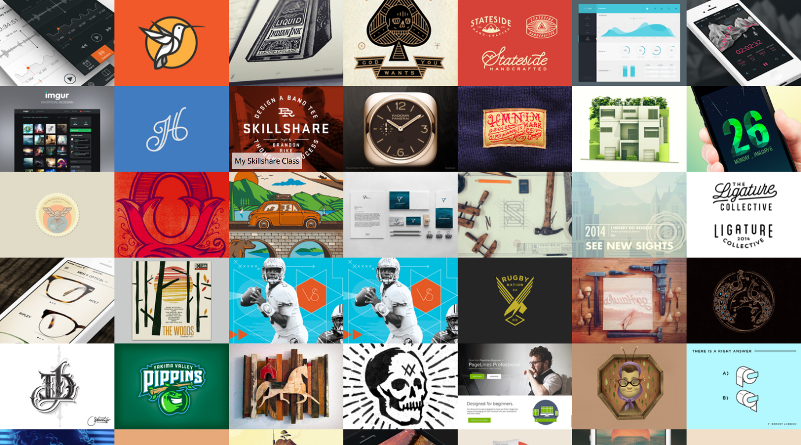

Recently I needed to refresh my memory of ExtJS and I figured the best way to do this was to build a simple demo app. It was only last August when I was using ExtJS day to day but as any developer will tell you, there is a limit to what you can keep at the forefront of your mind.

I decided to do something simple but ensure it also touched on the areas of ExtJS that I found were the most important. Specifically:

- Communicating with an API to retrieve data
- Rendering a UI based on the retrieved data
- Creating an efficient, lightweight UI – avoiding using heavy out of the box components
- Do something a bit fancy – I implemented a simple infinite scroll

### GitHub URL

I’ve just added the app to my github account.
- https://github.com/mbudm/extjs-dribbble

