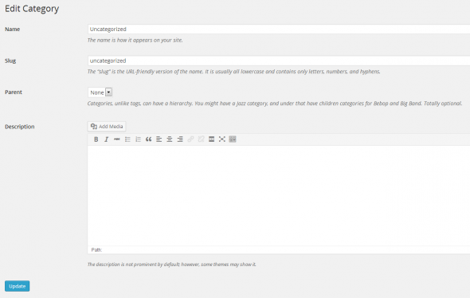
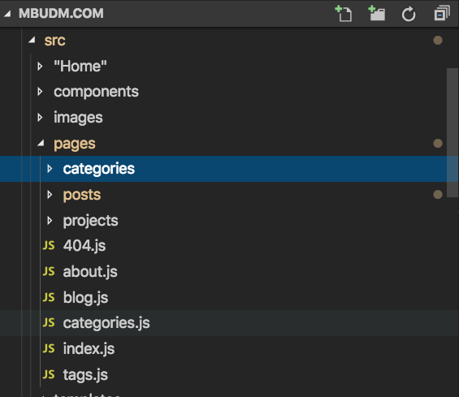

I quite like the information architecture of my old Wordpress blog that I created about 5 years ago and so am keeping the design with the move to Gatsby. 

### Why Gatsby? 
Like many people I got tired of endless wordpress upgrades and plugin incompatibility, and the cognitive shift that I had to make whenever some php editing needed to be done. So moving to a blog building tool that matches my day to day coding style makes sense.

The basics of building a wordpress style blog in Gatsby, with posts, pages and categories/tags are well covered in Gatsby tutorials:

- [posts creation from markdown](https://www.gatsbyjs.org/docs/adding-a-list-of-markdown-blog-posts/)
- [tags page creation](https://www.gatsbyjs.org/docs/adding-tags-and-categories-to-blog-posts/)

However there is one extra feature of Wordpress that I really like that I also wanted to replicate. This is the ability to add content to category pages, describing what the category is and why it's important to me. In the Wordpress editor this is a field in the add/edit category form.



In my Gatsby category template I treat this description in the same way I do blog post content, and I make some of these categories prominent on my home page and navigation. This gives a really nice and flexible way of highlighting what I see as the most important content.


In Gatsby, category and tag pages are generated by querying all the categories on all posts and generating pages for each unique category. This dynamic page generation is great as you can just create categories on the fly whenever you create a new post. 

However there is no obvious, easy way to add more content to the category page.

So I need some way of providing category descriptions that can be queried when category page generation occurs. Descriptions are just more data so what we need is a data source that can be queried.

### Planning for rich content

Category descriptions might start off as just plain text, but there's a good chance you'll want to add formatting or links. This is why I ditched my first idea of adding some category descriptions to `siteMetadata` in `gatsby-config.js`:

```javascript
module.exports = {
  siteMetadata: {
    title: "Steve Roberts",
    description: "Project updates, code demos and blue sky ramblings of a Product Development person",
    author: "#@mbudm",
    categoryDescriptions: {
      "design": "This is no place for markup",
      "development": "How can I link to that GitHub account?",
      "big-clients": "This was a bad idea",
    }
  },
  // ...
```

Adding content to `siteMetaData` has always struck me as akin to the lazy attitude of "just chuck it in the global namespace". So there must be a better way.

Instead I treat category description content for what it is — first class content — so I add markdown pages for each category. I've created a new folder under my pages directory:



The format of these pages is very simple. I add a title to the frontmatter block and add the detailed description with markup as the page content:

```markdown
---
title: Design is where my digital journey began, and I continue to be part of the design conversation
---
My early work in web production was primarily in [visual design](/tag/visual-design/). 

Later, as I have expanded my skillset I also took on [user experience design](/tag/user-experience-design/) roles that require [information architecture](/tag/information-architecture/) skills as well as [user research](/tag/user-research/) and [user testing](/tag/user-testing/)>.

More recently as a manager/lead in development teams I have worked with UX designers and Product people to shape the product direction we take.

```

### Adding category decriptions to auto-generated category pages

The trick is to add this new markup to the category pages that are already being auto generated from categories in posts frontmatter.

The first step is to identify the categories folder as a separate data source for the `gatsby-source-filesystem` plugin, just like we already have for posts. This makes it possible to query this data using graphql:

```
  // gatsby-config.js

    {
      resolve: `gatsby-source-filesystem`,
      options: {
        name: `posts`,
        path: `${__dirname}/src/pages/posts`,
      },
    },
    {
      resolve: `gatsby-source-filesystem`,
      options: {
        name: `categories`,
        path: `${__dirname}/src/pages/categories`,
      },
    },
```

Next, we want to modify the catgory page creation process so that we also add in this category metadata to the `data` that is passed a a property to the page template.

This happens in `gatsby-node.js`, I've got a few separate functions for handling the post, tag and category page creation:

```javascript
// gatsby-node.js

exports.createPages = ({ graphql, actions }) => {
  const { createPage } = actions
  return Promise.all([
    createPosts(graphql, createPage),
    createTagPages(graphql, createPage),
    createCategoryPages(graphql, createPage)
  ])
  .then(results => [].concat(...results)); // until node 12 is LTS and array.flat is available
}
```

The existing category page creation function is a simple replication of the [Gatsby tutorial](https://www.gatsbyjs.org/docs/adding-tags-and-categories-to-blog-posts/). 

Note that we filter the query by the field 'collection'. This means we get only the posts and not all the markdown in our new categories folder:

```javascript
const createCategoryPages = (graphql, createPage) => {
  const categoryTemplate = path.resolve("src/templates/category.js")

  return graphql(`
    {
      allMarkdownRemark(
        sort: { order: DESC, fields: [frontmatter___date] }
        filter: { 
          fields: {
            collection: {
              eq: "posts"
            }
          }
        }
        limit: 2000
      ) {
        edges {
          node {
            fields {
              slug
            }
            frontmatter {
              categories
            }
          }
        }
      }
    }
  `).then(result => {
    if (result.errors) {
      return Promise.reject(result.errors)
    }

    const posts = result.data.allMarkdownRemark.edges
    let categories = []
    _.each(posts, edge => {
      if (_.get(edge, "node.frontmatter.categories")) {
        categories = categories.concat(edge.node.frontmatter.categories)
      }
    })
    categories = _.uniq(categories)

    categories.forEach(category => {
      createPage({
        path: `/category/${_.kebabCase(category)}/`,
        component: categoryTemplate,
        context: {
          category,
        },
      })
    })
  })
}
```

To add in our category description data to the page template we need to query this too. So we need to expand our query to grab the data in the categories collection.

It's quite possible you have other data sources too so rather than relaxing the query by completely removing the existing filter, `eq: "posts"` I decided to use the regex property to specify the exact collections I want data from, `regex: "/(posts|categories)/"`

So the query would now look like:

```js
  `
    {
      allMarkdownRemark(
        sort: { order: DESC, fields: [frontmatter___date] }
        filter: { 
          fields: {
            collection: {
              regex: "/(posts|categories)/"
            }
          }
        }
        limit: 2000
      ) {
        edges {
          node {
            fields {
              slug
            }
            frontmatter {
              categories
            }
          }
        }
      }
    }
  `
```
Which means we can now get the category data and add it to each query page. But this will mean the categories and posts are all mixed up together in the edges array. We can improve this by using the [group](https://www.gatsbyjs.org/docs/graphql-reference/#group) property to break out the posts and categories collections:

```javascript
`
    {
      allMarkdownRemark(
        sort: { order: DESC, fields: [frontmatter___date] }
        filter: { fields: {collection: {regex: "/(posts|categories)/"}}}
        limit: 2000
      ) {
        group(field: fields___collection) {
          edges {
            node {
              fields {
                slug
              }
              frontmatter {
                title
                categories
              }
              html
            }
          }
          fieldValue
        }
      }`
```

 Now we can simply grab the posts and categories easily in JavaScript by finding the right one in the groups array:

```javascript
    const posts = result.data.allMarkdownRemark.group.find((g) => g.fieldValue === "posts").edges
    const categoriesMetadata = result.data.allMarkdownRemark.group.find((g) => g.fieldValue === "categories").edges
```

And for each createPage call we now add the category data to the page. I'm doing this by parsing the slug for the category which is a bit brittle but will do for now.

```javascript
  categories.forEach(category => {
      // get the category title and description
      const catKebabCase = _.kebabCase(category)
      const catMetaEdge = categoriesMetadata.find(edge => {
        return _.get(edge, "node.fields.slug") &&
          edge.node.fields.slug.split('/').includes(catKebabCase)
      })
      createPage({
        path: `/category/${catKebabCase}/`,
        component: categoryTemplate,
        context: {
          category,
          categoryTitle: catMetaEdge && catMetaEdge.node.frontmatter.title,
          categoryDescription: catMetaEdge && catMetaEdge.node.html
        },
      })
    })
  })
```

Then in the category template render the category description content if it is available:

``` javascript
// /src/templates/category.js

  const Category = ({ pageContext, data }) => {
  const { category, categoryTitle, categoryDescription } = pageContext

  const posts = data.allMarkdownRemark.group.find((g) => g.fieldValue === "posts")
  const postsEdges = posts && posts.edges

  return (
    <Layout>
      <SEO title={category} />
      <PageBody pageTitle={category} subTitle={categoryTitle} >
        {categoryDescription && <div dangerouslySetInnerHTML={{ __html: categoryDescription }} />}
      </PageBody>
      {postsEdges && <PostList posts={postsEdges} label={categoryDescription && category}/>}
    </Layout>
  )
}
```
You can see how this looks by taking a look at any of my category pages like [Design](/category/design/) or [Development](/category/development/). For simplicity in this post I've omitted references to another data source I use, projects which you'll see on these category pages and in the source, available on my public [Github Repo](https://github.com/mbudm/mbudm.com/blob/master/gatsby-mbudm/src/templates/category.js).
