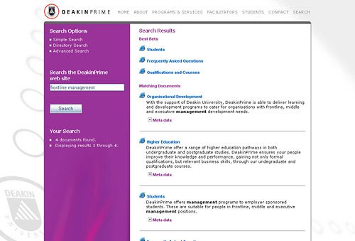
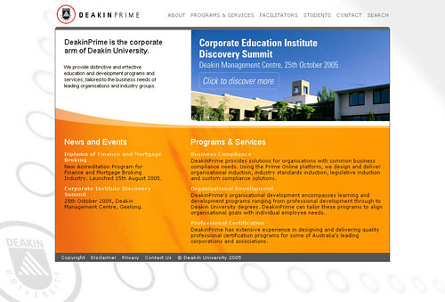
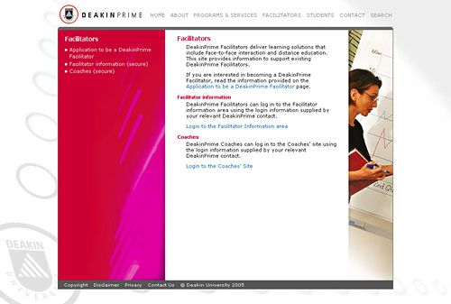
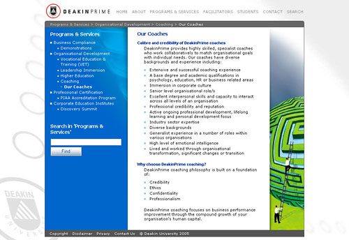
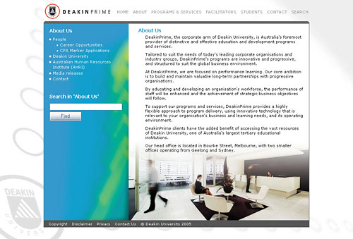

DeakinPrime.com is a web site that markets a lot of educational programs and services to a broad demographic encompassing SME's, large corporations and government departments. The site must present a complex product offering to suit this range of user expectations.

DeakinPrime has to follow University guidelines so the site is XHTML valid and adheres to W3C level A acccessibility.

My aim for the 2006 version of the site was to create a well designed site, manageable and adaptable to a constantly evolving product suite that was not impeded by regulatory requirements.  
 

 

 

 

