Prime Online was a clever and highly efficient way of producing customised eLearning solutions for a range of client needs. This Product was my core responsibility while at DeakinPrime from 2002-6. As well as leading the design and development of this product I had my first taste of Product Management with budget responsibility and contribution to the sales and marketing strategy along with the Business development and Marketing teams.

Prime Online reduced the cost of eLearning development at DeakinPrime by up to 75%, which allowed us to continue to operate in a highly competitive market. The projects listed here are just some of many client projects that used the prime online system.

### Sydney Airport - Touchscreen quiz

[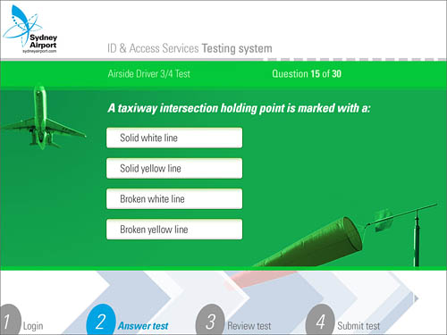](./sacl_test_answer.jpg)  
Sydney Airport elected to conduct ASIC accreditation testing on site. After commissioning a program from DeakinPrime in 2002, that required applicants to use a regular PC, they have concluded that a touchscreen application would be better suited to their users.

### **Goldman Sachs JBWere - Working with us**

[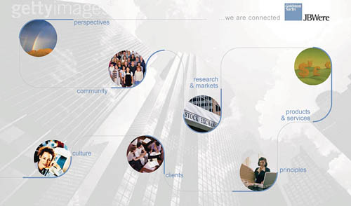](./gsjbw_org_menu.jpg)

  
Part induction - part change management strategy, the newly merged Goldman Sachs JBWere are intending their induction program for all staff. Not only do they wish to streamline training on policies and procedures, team building and acceptance of the new workplace culture is also a goal of this package.

At the time of my departure in 2006 we were negotiating the scope of the project, with development work scheduled for mid 2006.

### **CPA Self Assessment Testing**

[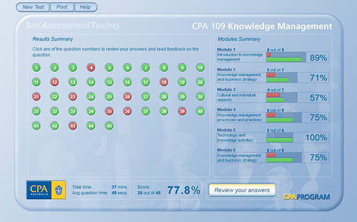](./cpa_summary.jpg)

[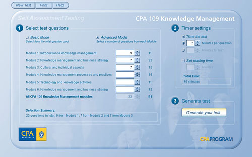](./cpa_setup.jpg)

[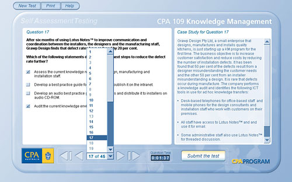](./cpa_assess.jpg)  
A Prime Online based application that provided a simulated exam environment for CPA students. The application was used by approximately 4000 students per semester. The application was launched in Semester 2 2006, following extensive user acceptance and editorial testing.

### **Maritime Security Identification Card (MSIC) - Port of Melbourne Corporation**

The MSIC was a new requirement in 2005 that all Australian ports must adopt to manage security and access.

The MSIC training module had to be successfully completed by anyone who required access to restricted areas of the Port.

[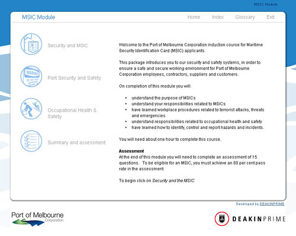](./pomelb_home.jpg)

### **AusMeat Beef Product Specification**

[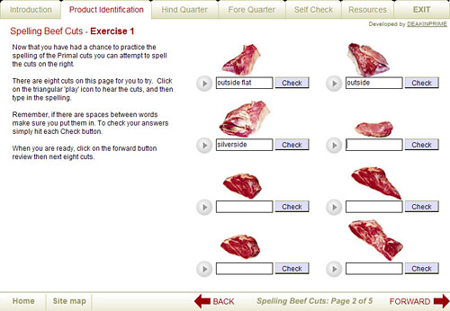](./ausmeat_mfb.jpg)

[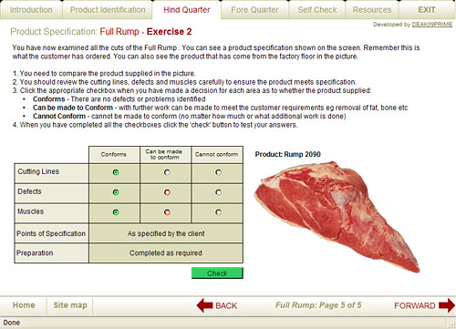](./ausmeat_ex2.jpg)

[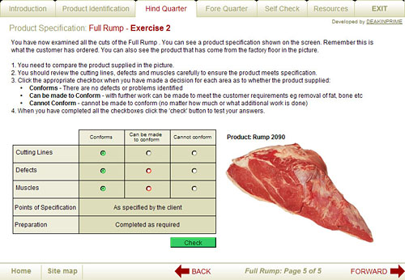](./ausmeat_ex1.jpg)  
Meat industry workers need to know how to make the most of a beef carcasse. Incorrect or poorly cut products can lead to expensive losses over time.

This CD was sold by AusMeat to its industry members as a training package to prepare meat workers for a practical examination.

The application was built with Prime Online and delivered as an executable on CDROM.

Vegetarians should probably avoid looking at some of these screen shots from this project.

### **Sanctuary Cove Induction Online**

Sanctuary Cove is a resort and function centre employing approximately 100 full-time and casual staff. Turnover is fairly high especially with seasonal casuals, and each new employee needs to be inducted into the organisation. Sanctuary Cove is a diverse workplace with many areas that some staff may not be used to working in, so knowledge of OH&S issues in these unfamiliar areas is very important.

DeakinPrime developed a PrimeOnline Induction program for Sanctuary Cove. This program guided the participant through Sanctuary Cove OH&S policies and general workplace issues. At the end of each section of the induction, the program presented the participant with a short quiz. Results of the quiz are emailed to the Sanctuary Cove HR Manager. The HR Manager received a Prime Online editing tool for updating the Induction program as required.

### Council Induction - Colac Otway Shire Council

Colac Otway Shire Council and seven other councils in the local area form the South Western HR forum. This group works together to establish programs and policies that benefit all member Councils. It was recognised that each Council faced similar issues with inducting staff in a consistent, reliable and efficient manner.

DeakinPrime developed a Prime Online Induction program for the HR forum. This program covered the general HR issues faced by each council, and it also provided suggested areas for individual councils to include their specific content needs. The HR Manager of each council received a Prime Online editing tool that allowed them to tailor the induction program to suit their specific need.

[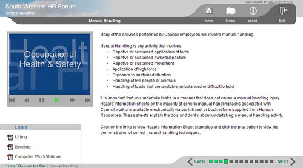](./colac_video.jpg)

### Melbourne Airport - Airside Access

The Airside Services department at Melbourne Airport is responsible for monitoring all airside activities at the airport.

Airside Services staff are shift workers, making it difficult to schedule face to face training sessions for all staff. The department is audited annually by the Civil Aviation Standards Authority (CASA) and an outcome of the 2002 Report was to improve compliance testing.

DeakinPrime developed 25 training modules which the Airside Services Manager can edit and maintain, and he can also provide reports on Airside Services staff compliance records.

The CASA Airside Services audit in 2003 and 2004 stated that Melbourne Airport was an industry leader in compliance with CASA Airside Access regulations.

[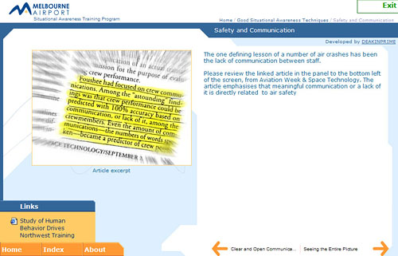](./ma_vanilla.jpg)

### Contractor Safety - Coles Myer Limited

The maturity of the Prime Online application was well demonstrated by this project for Coles Myer in the astounding reliability and lack of support costs. Over 100,000 contractors completed the Coles Myer Contractor Safety program. At the time of my leaving DeakinPrime in 2006, we only had 7 bug reports escalated to us, which were resolved.

[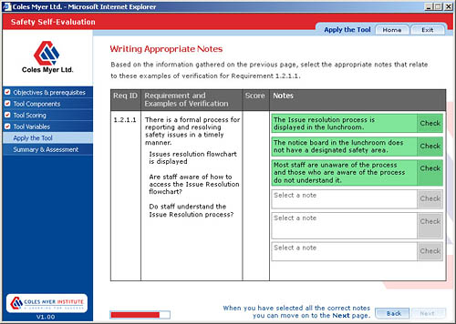](./cml_safety_eval_writing.jpg) [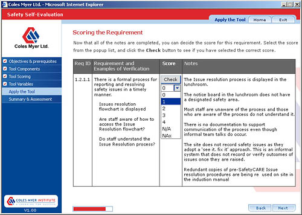](./cml_safety_eval_scoring.jpg) [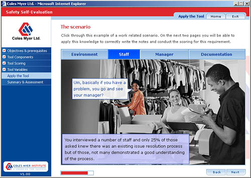](./cml_safety_eval_scenario.jpg) [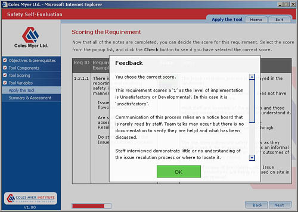](./cml_safety_eval_fb.jpg)

### Deakin University Induction

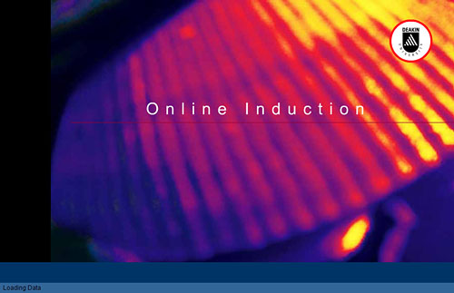

The Deakin University staff induction simplified the sheer weight of information that new staff must grasp when they commence employment at Deakin University.

The HR department used the supplied editing tool to keep links to policies and procedures up to date.

### Tatura Milk Induction

The Tatura Milk Induction was the very first Induction project that DeakinPrime completed. Tatura are a medium sized dairy processing plant with about 250 employees. This number increases seasonally when a lot of casual workers must be trained in safe work practices in a very short time.

[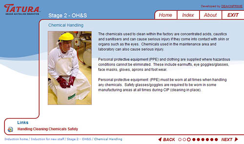](./tatura_vanilla.jpg)

### Beginning Practice in Child Protection – Department of Human Services Child Protection Professional Development Unit

Although not actually built using the Prime Online CMS, a lot of the architecture and design of Prime Online eveolved from this custom Flash project. Beginning Practice is an orientation program for which Deakinprime developed five modules that integrate with several other learning components developed in-house by DHS. These other components include a self-paced participant guide, face to face workshops, and a mentoring program.

The components of the Beginning Practice program are integrated to provide continuous support for new practitioners. The DeakinPrime modules use characters and case studies that are revisited via activities and case studies in other components of the program.

The Minister for Community Services launched the program in November 2002.

[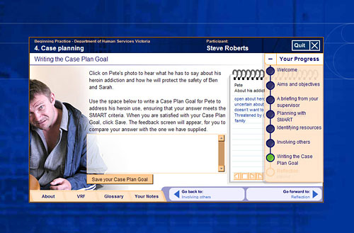](./dhs-pete.jpg)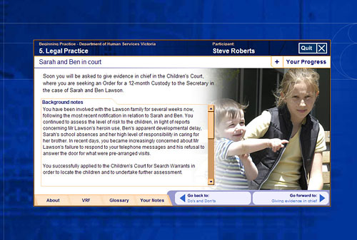[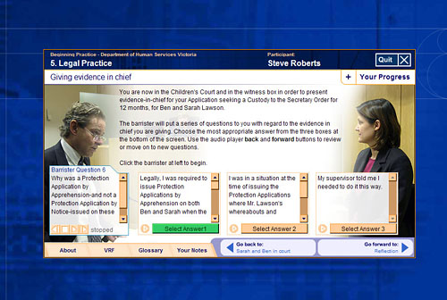](./dhs-evidence.jpg)[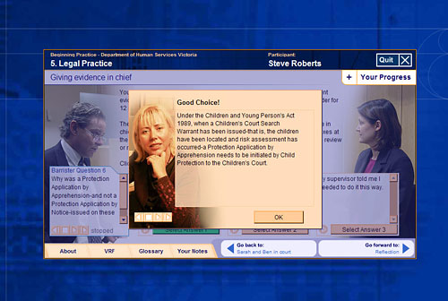](./dhs-evidence-fb.jpg)

### DeakinPrime Staff Induction

A product that is used in house by the company that sells it is usually a pretty good sign of the product’s quality, it even has a name in industry jargon, 'eating your own dog food'. This program was an in-house implementation of the Prime Online eLearning publishing system built by me and my team. This induction program gave new employees a quick introduction to company policies and procedures. It complemented other face-to-face induction processes.

[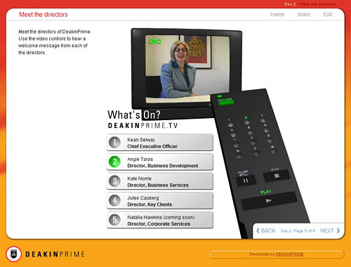](./steve-folio-dp4.jpg) [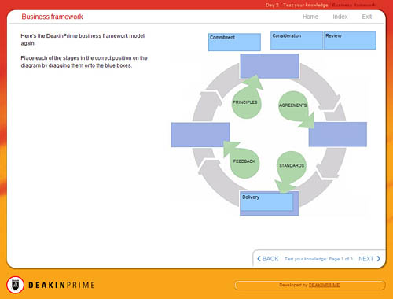](./steve-folio-dp3.jpg) [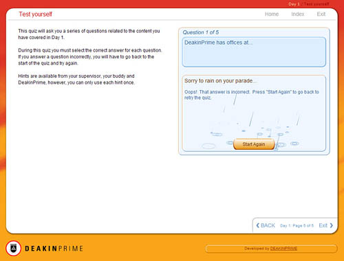](./steve-folio-dp2.jpg) [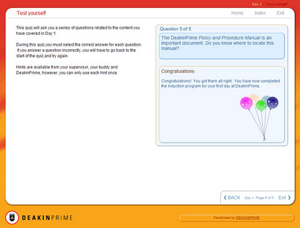](./steve-folio-dp1.jpg)

### BlueScope Steel Load Restraint

A training package in load handling for truck drivers. BlueScope Steel uses approximately 5000 truck drivers across the Asia Pacific region. Damage to products and injury to drivers and other motorists can occur if steel products are not properly restrained.

This was the first project in the BlueScope eLearning project, the success of which has led to a request for three more projects that were delivered in late 2006 after I left DeakinPrime.

[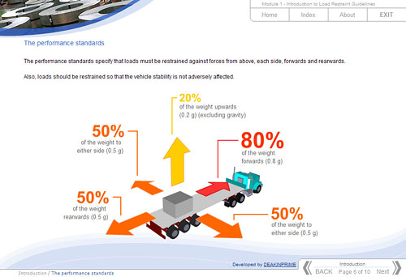](./bss_truckdiagram.jpg) [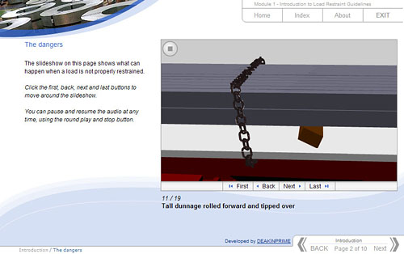](./bss_slideshow.jpg) [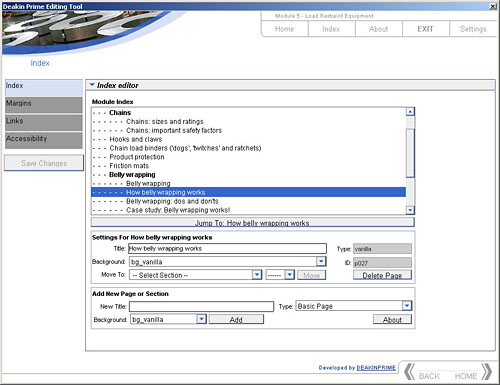](./bss_editing_tool2.jpg) [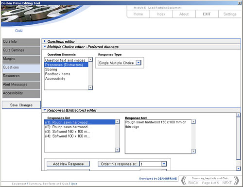](./bss_editing_tool.jpg) [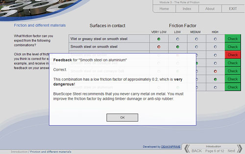](./bss_chkgrd.jpg) [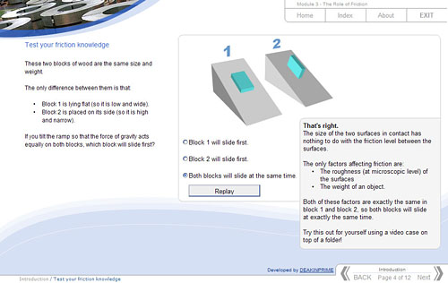](./bss_3danim.jpg)

### ASF Lifetime Loan - Australian Seniors Finance

ASF accredited sales representatives needed to be thoroughly trained on the financial detail of ASFs Lifetime Loan product.

ASFs market demographic (asset rich retirees) expect ASF representatives to know the product inside out.

This training site used case studies and simulators to prepare representatives for the tough quiz where they had to achieve 100% to receive certification.

[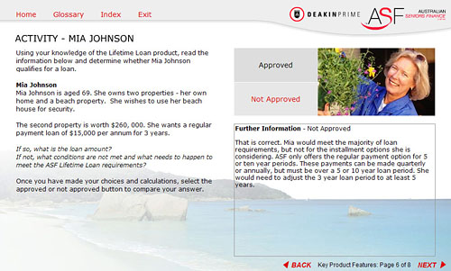](./asf_hotspot.jpg)

### FoodWorks Supermarkets Induction

The FoodWorks supermarkets induction provided a consistent and friendly welcome for new staff. It also ensures that the young workforce are aware of occupational health and safety issues.

[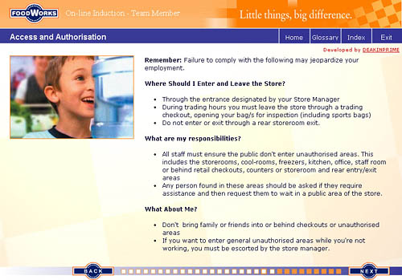](./fw_vanilla.jpg)

### Information Privacy Awareness - Deakin University

### 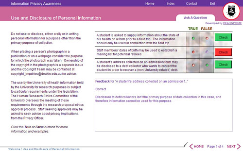

Privacy laws affect the use of personal information that Deakin University must collect legitimately from students. Staff need to be aware of what constitues correct use of personal information.

This small site guided staff through all the University guidelines on use of personal information.

### Exam Supervisor Guide - Deakin University

[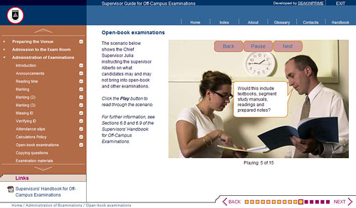](./dua_dialogue.jpg)  
The Assessments Department at Deakin University manages all examination supervisors. Exams can take place on or off-campus and it is important that exams are run in a consistent manner.

This site guided examination supervisors through all the policies and procedures they must follow.

### City West Water Induction

The City West Water Induction site provided a consistent and professional induction for new staff. It also ensured that the large and diverse CWW workforce were aware of occupational health and safety policies and procedures.

[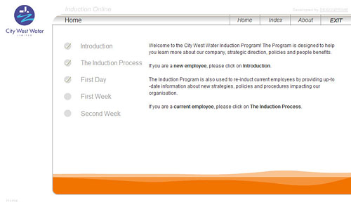](./cww_home.jpg)
