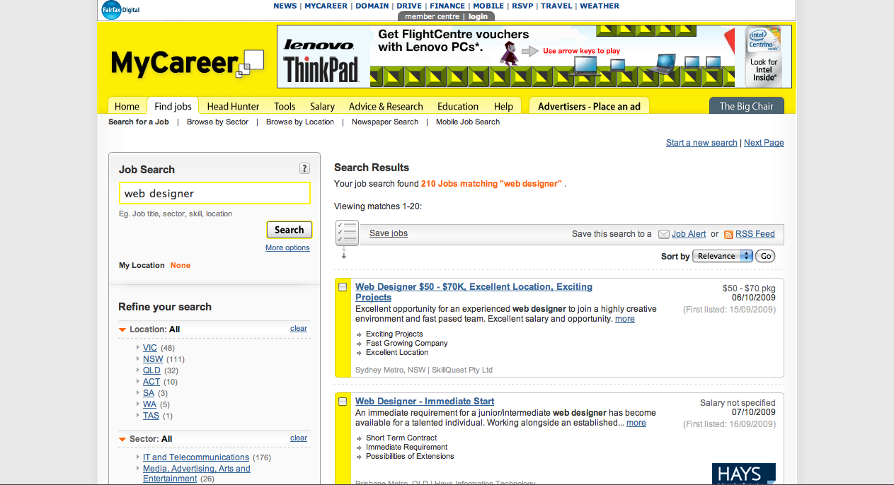

The MyCareer.com.au web site was originally built when 800x600 was the most common browser size. By December 2006, an expansion of the site to a wider aspect was needed.

The business case was predominantly to cater for standardised ad sizes, specifically a Leaderboard in the header area and 300px columns to suit medium-rectangle sizes. However this was also seen as an opportunity to modernise, and optimise the effectiveness of the user experience.

This involved a major redesign, with PSD mockups for the key user flows, and brand new CSS and html markup throughout the site.

I was the Senior Designer, leading a team of three and coordinating the implementation strategy with the MyCareer technical team. This was my first introduction of working in an Agile project. The project was completed and received very well, with increased growth on all measures for MyCareer throughout 2007.

