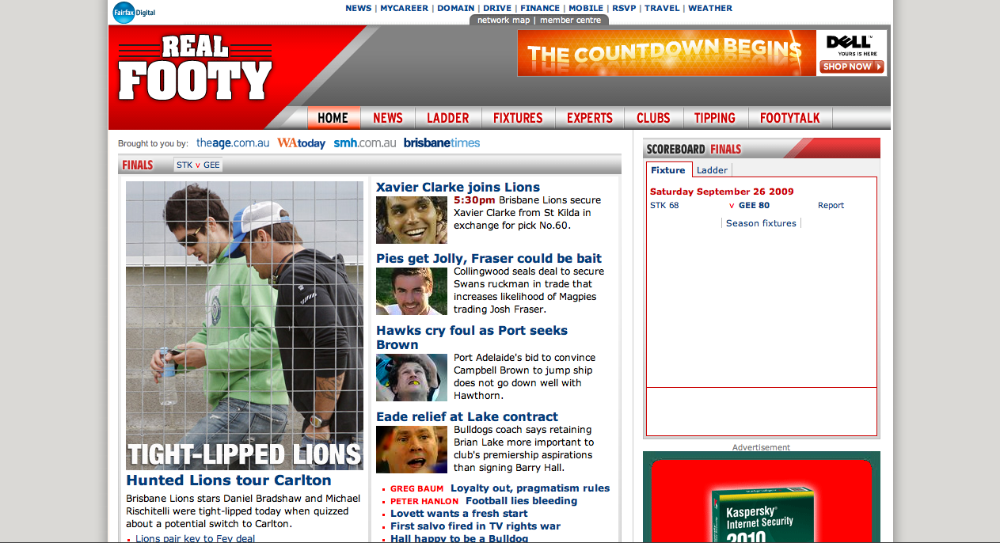
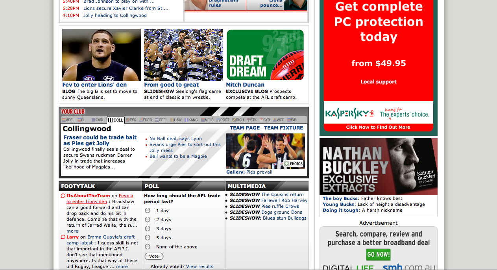
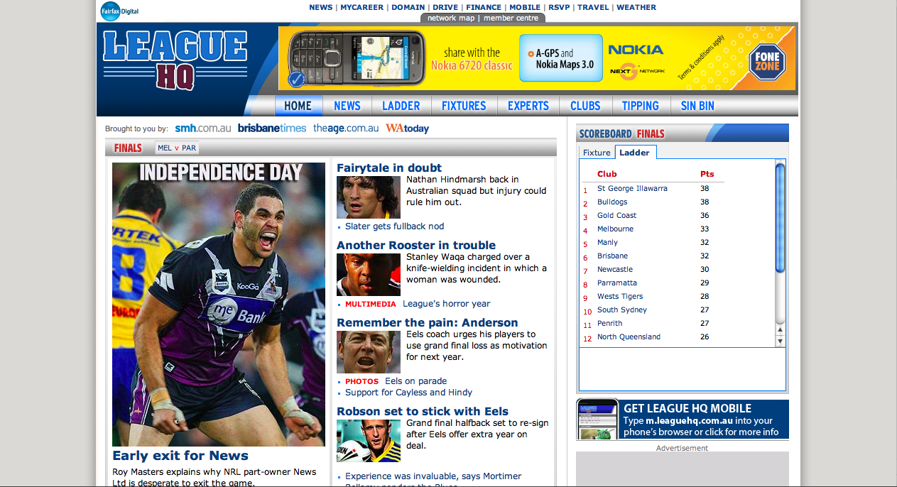
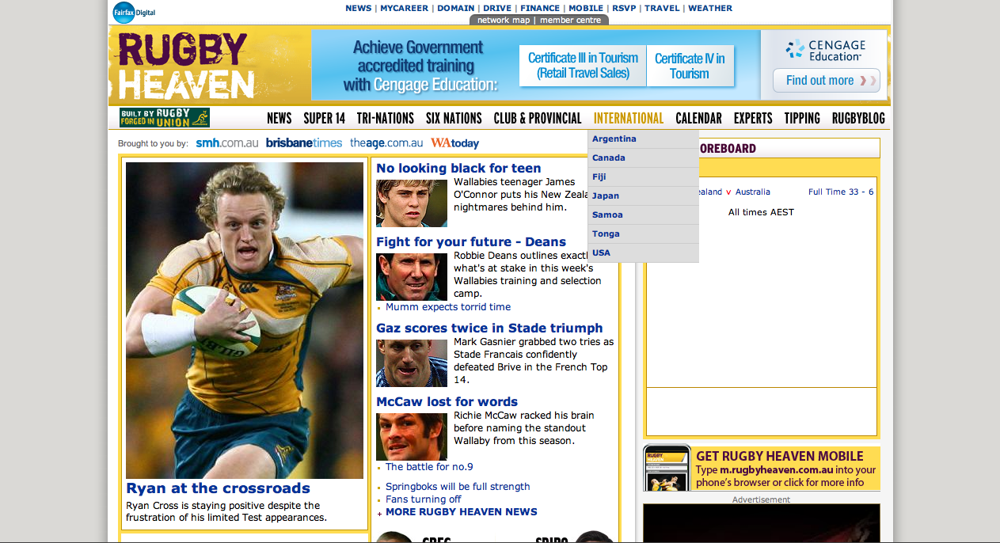

### Real Footy

The brief for RealFooty was for a site that needed to be fun, big, brash and bright, making great use of team colours (but not the logos due to licensing restrictions). However the site also had to work within the technical limitations of the existing publishing system.

The  design process for RealFooty was much longer than usually allowed on Fairfax Media Projects. This was because the design for RealFooty was also to act as a template for RugbyHeaven amd LeagueHQ - Fairfax's offerings for the other football codes.

Likewise, the XHTML, CSS and JavaScript work on this site that myself and our newly hired HTML/CSS specialist completed was also designed to be adaptable to the sibling sports sites.  
 

 

### League HQ

LeagueHQ was an adaptation of the design I created for RealFooty, despite the obvious similarities in the layout and techniques, a completely new identity has been achieved.  
 

### Rugby Heaven

RugbyHeaven was also an adaptation of the design I created for RealFooty,and had to look different to not only the original design but more importantly, different to the rival rugby code site above.
 
