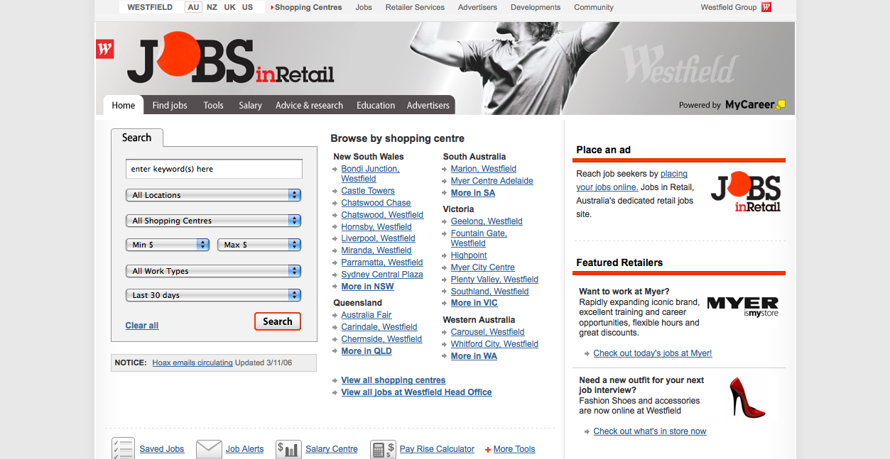

As Product Manager for  jobsinretail.com.au I was the key Fairfax Media representative in this partnership with Westfield.

Westfield were a very persistently assertive partner and it was essentially my job to keep the relationship buoyant whilst maintaining a level of web business strategy and technical support that was sustainable from Fairfax Media's point of view.

What this meant was that I had to say 'No, we can't do that' a lot, while still keeping our partners happy by implementing whatever initiatives that were possible using relatively few resources.

 
