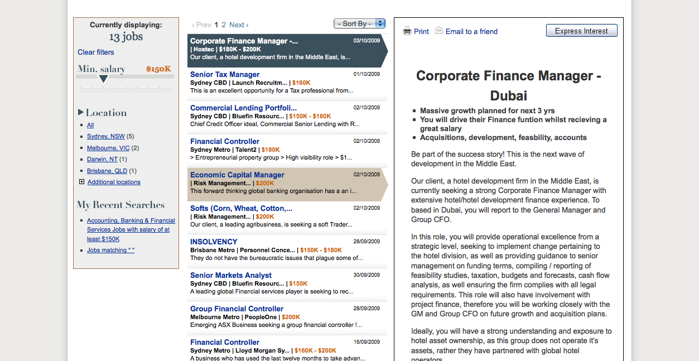

The Big Chair is was an executive employment site that was launched in April 2007, it's launch was leveraged of the existing generalist jobs site MyCareer.com.au.

When I joined MyCareer as a Product Manager in mid 2007 the task of managing the further developments of The Big Chair were given to me.

Over the next year I managed to negotiate several improvements to The Big Chair, and my efforts in concert with the Marketing team and Content team saw the site increase it's audience tenfold from 10k/Month in July 2007 to 100k UBs by mid 2008.

My contribution was to analyse the stats and identify process improvements. This involved making clearer navigation, better search options and converting the large amount of passive traffic that the content team attracted via engaging editorial into active jobseeking users.

Some time in early 2011, after a bumpy couple of years for Fairfax it appears likely that they decided to cull some web sites, with The Big Chair being one of these. They have moved executive jobs back into MyCareer.com.au.

 

 
