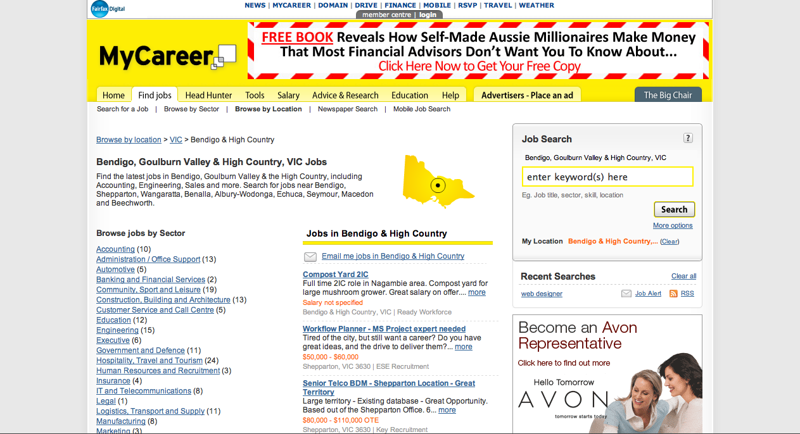

In late 2007 Fairfax Media merged with Rural Press, creating a much more national footprint for Fairfax's offerings.

As Product Manager on the MyCareer locations project, I needed to negotiate a re-categorisation of the location search criteria on mycareer.com.au and liaise with the Rural Press team to create a well integrated job search solution for our new Regional audience.

Technically this involved a complete restructure of the location logic behind classified employment ads, and after much research we found that Local Government Authority (LGAs) were a useful building block for defining regions and areas that captured job seeking areas quite well.

In addition to this the needs of sales teams had to be negotiated as well, achieving a balance between highly localised categorisation that advertisers desire (i.e. 'can I have my town name as prominent as possible please?') and usable national and state level hierarchies that job seeking users can easily navigate.

