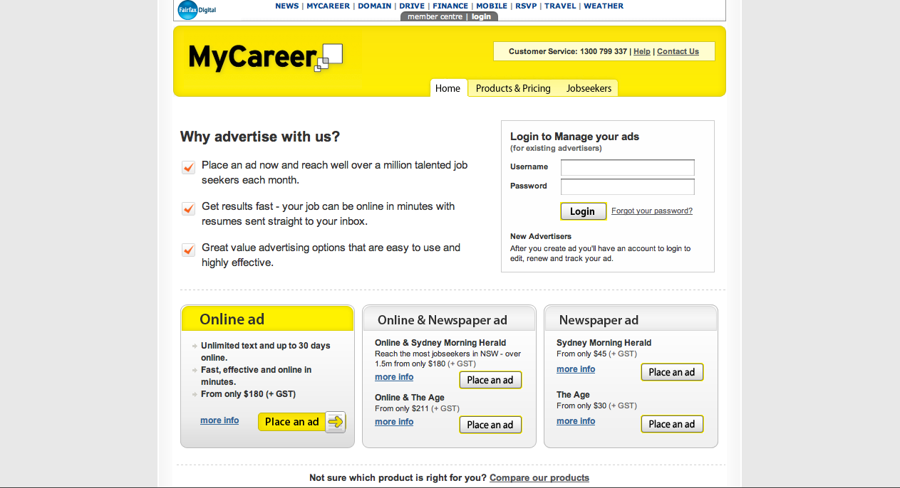

In June 2008, I was appointed to a difficult and fast paced project which had been given the personal go ahead by the Fairfax Media CEO.

The project was a merging of the online and print employment classifieds offering in NSW. This necessary step in managing the transition of the customer base from print to online was fraught with difficulty as the systems involved in the print classified area are old, multifarious and often incompatible with the newer web based systems.

In addition to the technical hurdles, there were also seemingly insurmountable HR issues between the Print and online worlds as two Sales teams merged into one.

As one player in a project that encompassed almost all senior managers in print and online classifieds it was mine and my Project Manager's responsibility to keep stakeholders focused and in agreement with the technical steps we needed to take while deflecting a barrage of political issues that occurred on a regular basis.

