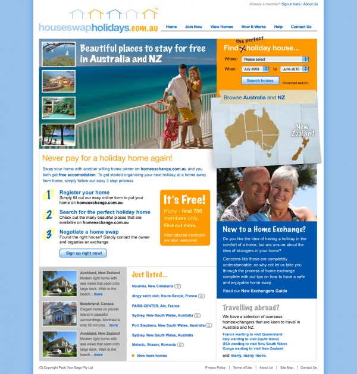
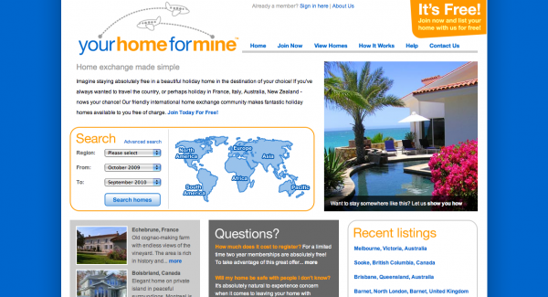

The client brief for this [House Swap Holidays](http://houseswapholidays.com.au/ "House Swap Holidays") was for it to feel Australian but not overly 'ocker' or stereotypical/cringeworthy. Virgin Blue was cited as a good starting point - a little bit cheeky but 'modern'. As with the design for YourHomeForMine.com this site has to make do with relatively low inventory at launch, so the use of imagery and different approaches to browsing the content gives an impression of a broader depth of inventory than there is.

The client requested that [Your Home For Mine](http://yourhomeformine.com/ "Your Home For Mine") be "Fresh vibrant, evocative of a travel site, busy - giving the impression that there is a lot going on". As with any new directory based web site the client started off with a low inventory so the design makes the most of what is available to give the impression of an active marketplace.

