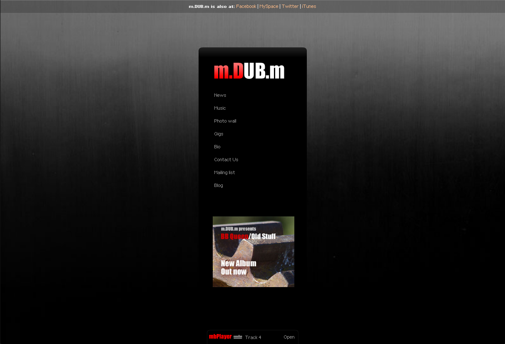
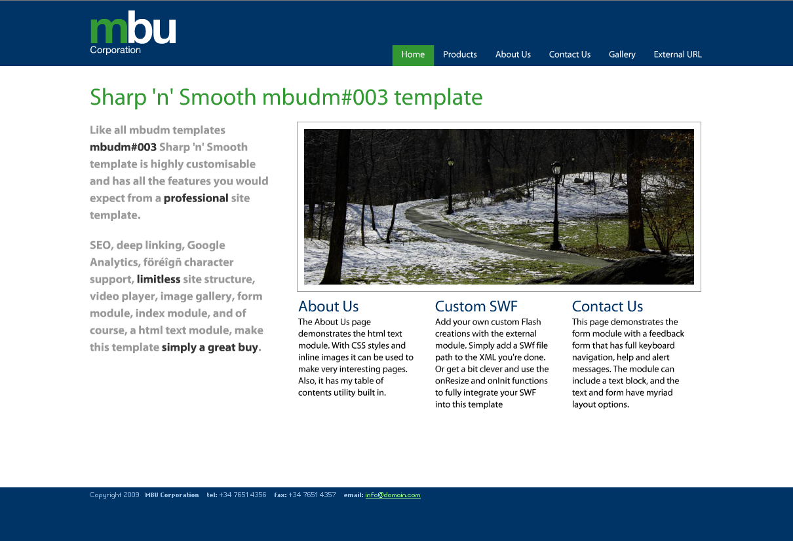
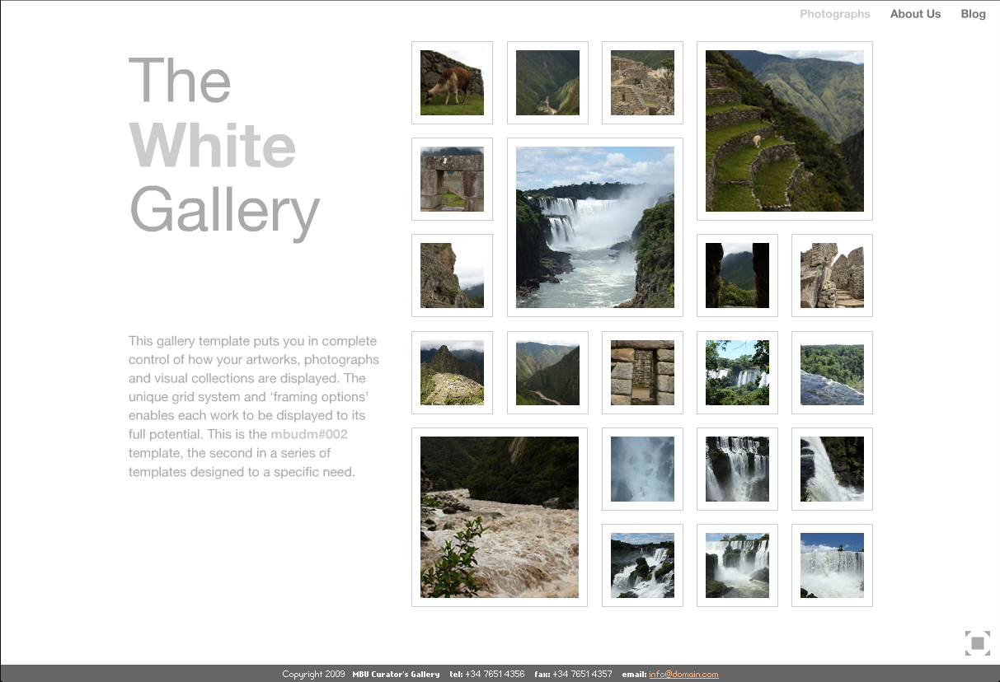
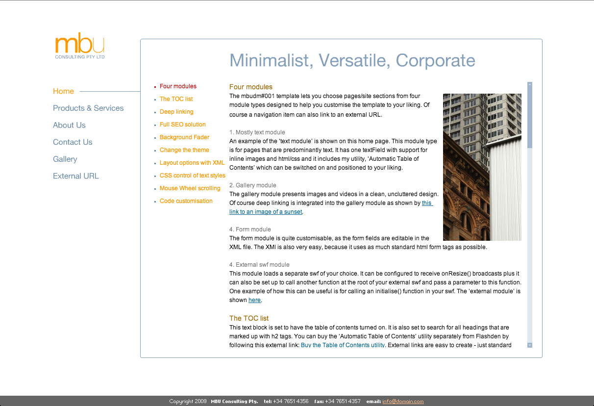

During 2009 I created a number of [stock components, site templates and animations](http://www.activeden.net/user/mbudm/?ref=mbudm) using Flash, a tool that I enjoy working with but don't get much use of in my consulting work. These files are hosted at the ActiveDen stock marketplace. I have had a reasonable amount of sales from this, and it was a great way to keep up my product management, design and development skills whilst travelling around the world.

 
 
 
 

Edit: In late 2011 I removed the majority of my folio items. With the demise of Flash and it made no sense to continue to support these items. 
