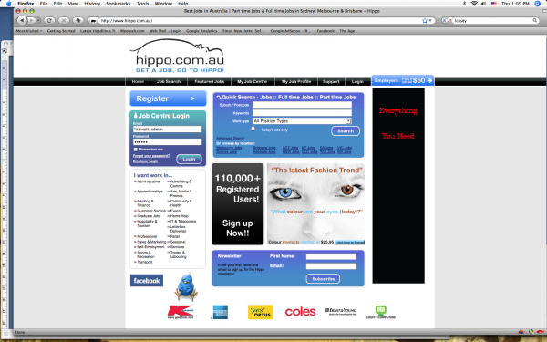
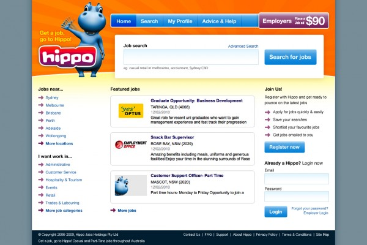
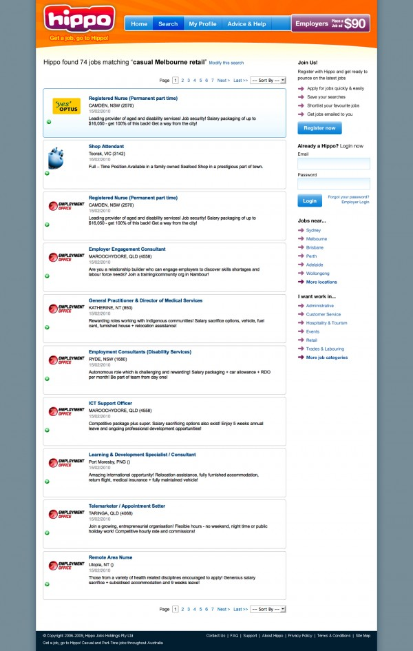
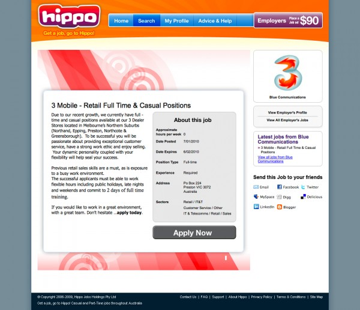

Hippo.com.au is a youth focused employment site that was launched in 2005. Like other players in the market it's fortunes took a hit towards the end of 2008 as the GFC hit and many employers took a risk averse approach to hiring.

Hippo then changed hands a couple of times before being picked up by Classified Ad Ventures. During this tricky part of it's existence the site had been modified from the original concept to be a more generalist employment site. Feedback and research into the marketplace in late 2009 was that the original youth strategy should be revisited.

I was engaged in early 2010 to review the existing site and provide a first stage solution for bringing back the strong hippo brand and simplifying the jobseeker experience.

My solution was to bring back the hippo character and the fun and friendly colour scheme as well as to re-engineer the site so that signup and registration were less prominent and the jobs and application calls to action were more clear.

