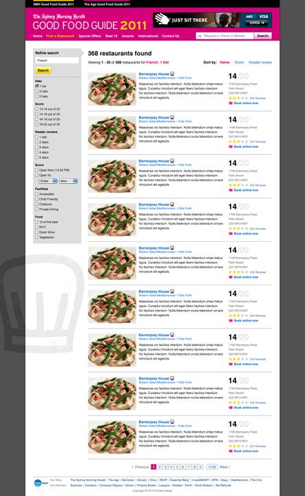
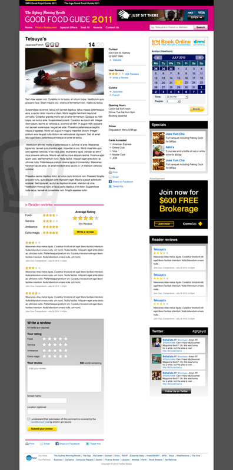

The Sydney Morning Herald and The Age Good Food Guides are the Michelin Guides of Australia. If you are into food then you have these on your shelf and consult them regularly. If you work in the restaurant industry then you await their publication each year with a sense of foreboding or giddy hope that your eatery may gain a Chef's hat or two.

In 2010 Fairfax media, the publishers of these guides, decided to expand the offering to include an iPhone app and a web site that could engage readers and be updated more regularly throughout the year as new restaurants arrive and older ones close their doors.

I was engaged to handle the interface design and to manage the development of the front end templates (HTML/CSS/JavaScript).

The design needed to reference the existing printed book design but not mimic it, as the books change each year but the website is expected to keep the same style for a longer cycle. Also the site needed to be very clear, subdued, and let the food pictures take centre stage, with prominence of user generated content a close second. Also the Chef hat motif had to be central to the design as it is the key identifier of the brand.

My solution used the Chef's hat sparingly and tantalisingly just out of reach, to maintain it's allure of exclusivity. The heavy colours of the current crop of books were used but only in key areas for ease of future change and these were offset by expansive use of whitespace and subtler generic UI elements that are designed to adapt to potential future book styles.

