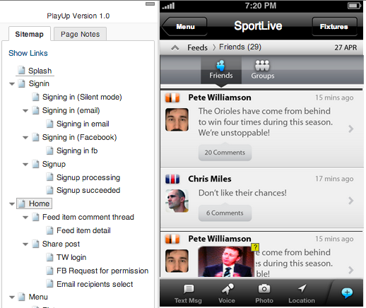
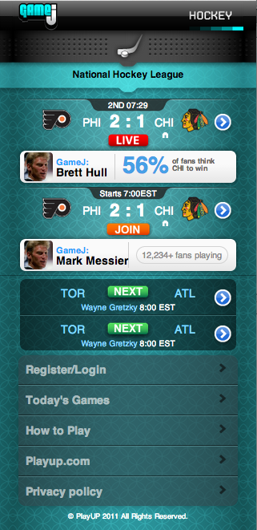

In 2011 I completed a series of projects for a mobile games developer. For some of these projects I created HTML/CSS for mobile web versions of games, leveraging CSS3 to minimise the use of graphics and to speed up the interface. I also completed a series of UX tasks for some native iPhone and iPad applications. I used Axure to rapidly prototype using a combination of wireframes and some key Hi-fidelity screens. These prototypes needed to be complex/realistic enough to be used for User Testing.

### [Axure Prototype](http://mbudm.com/clients/playup/prototypes/v1_iteration1/)

### [Mobile Web templates](http://mbudm.com/clients/playup/gamej/)

