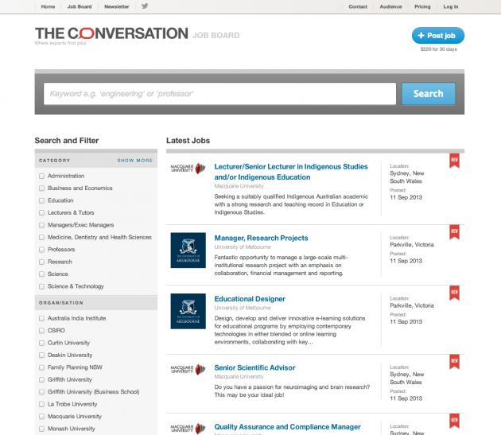

### Background

The Conversation is an innovative response to the collapse of quality journalism in the last 10 to 15 years. With the drying up of the advertising 'rivers of gold' and exodus of eyeballs to other mediums, traditional commercially funded journalism has all but disappeared. The Conversation marries an untapped resource, academic experts, with journalistic flair - to make expert knowledge accessible and relevant to consumer media demand.

### Brief

The Conversation as a non-commercial entity needs to ensure it's sustainability by structuring varied and reliable funding sources. One plank in the commercial strategy was to launch a job advertising business, leveraging the highly educated and unique readership of The Conversation but without blurring the hard fought independence of the website content, that other commercial relationships can risk.

### Approach & Result

As a UX and product consultant with a background in online employment businesses I was approached to oversee and advise on implementation of The Conversation Jobs. Thedevelopment team at The Conversation have a very mature product focussed agile approach and so my role was definitely one of the team rather than a hands off executive stakeholder. As part of my role I encouraged the adoption of a flat job board structure to best utilise the boutique inventory. I deftly handled the impact of commercialisation of a principled independent site with strategies for gradual increase of cross linkages and promotional spots in order to deliver a viable job board audience, based on my inside knowledge of existing job board conversion metrics and client expectations of their advertisement performance. I also managed research and recruited candidates for mid stage user testing the earliest usable alpha release. Findings included need for clearer integration to existing site as well as numerous minor but effective UI enhancements. The Conversation Jobs launched in October 2011 and continues to be a key plank in the organisations commercial strategy that has scaled with the business as it expands internationally.

