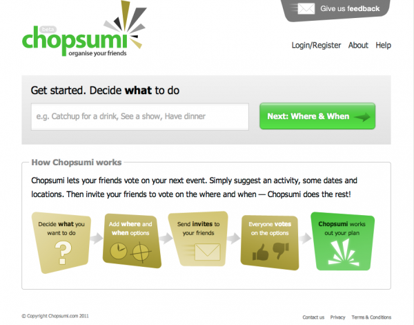

[Chopsumi.com](http://chopsumi.com "Social voting with Chopsumi") is a new online tool for easily organising your friends and improving your social life. The problem that Chopsumi solves is pinning down as many of your friends as possible to a specific date and location for your event. Previously this was achieved via long email discussions and a lot of work on by the organiser in trying to sift through everyone's available dates and particular location preferences.

  
The process is very simple, and a lot of work was done on the user experience, testing and re-testing to make the tool as easy to use as possible. We also want this tool to appeal to a very wide audience so we have paid particular attention to testing with older or non-technical users.

We iterate development, and try to minimise what we produce given that our resources are limited. The next phase will be to implement mobile web templates that I have already repared and are [waiting in the wings](http://mbudm.com/groupbuy/mobile/home.html "Mobile templates for chopsumi - reduce your browser to see responsive goodness").  

Chopsumi is a self funded project that is designed to begin with a broad and open ambit and will be focussed on to more specific niches as our userbase shows what uses they have for this organising tool. The tool has inherent natural growth via the inviting of friends we are confident that of continuing steady growth.
