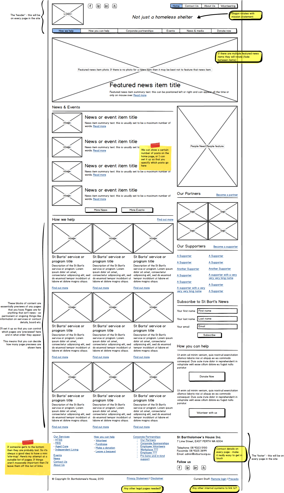
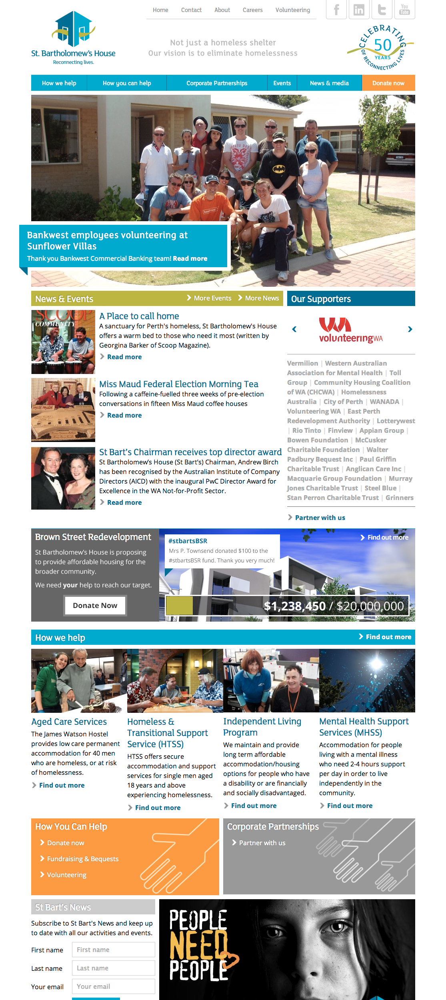

I have been consulting to St Bartholomew's House since 2009. Initially I acted in a pro-bono capacity, where I provided support and strategic advice whenever they need to conduct any campaigns or events that required an online presence.

In late 2011 a new Community Manager was appointed and a review of vendor services lead to St Barts' engaging me as an ongoing web strategy consultant. My primary role is design, development and maintenance of [stbarts.org.au](http://stbarts.org.au) as well as continuing my role as digital strategic advisor in funding campaigns and events.

With St Barts I have established what I believe to be a unique and mutually beneficial working arrangement. I handle basic day to day and week to week technical, design and content publishing issues and because I have a consistent engagement with the organisation I am able to provide an in-depth design and strategic consultancy service when a bigger project arrives. If I were engaged by St Barts only when bigger projects came along, I would have to add in a design discovery and research phase to any realistic project proposal.

This method of working ensures that micro and macro digital needs are provided and the cost of my service is spread more evenly across the year.

