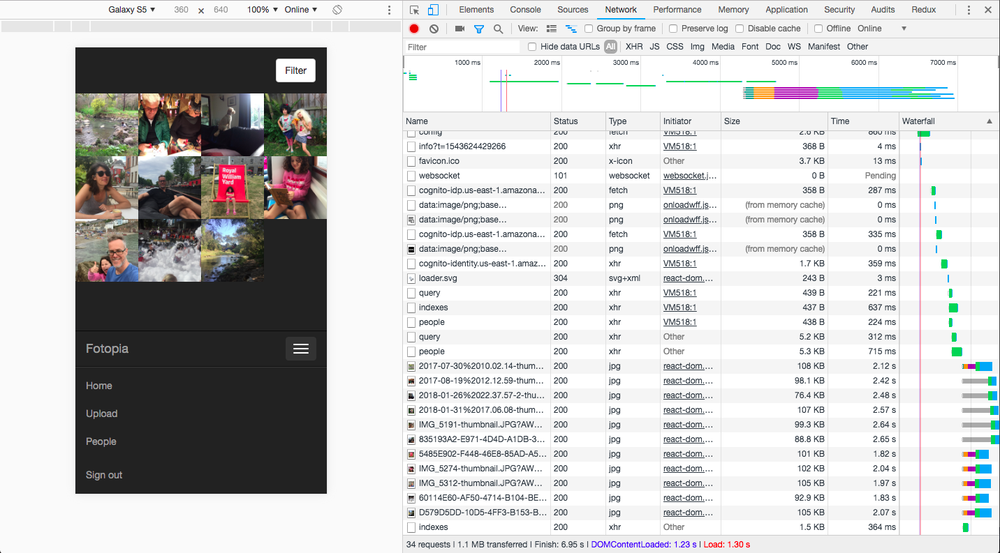

With anything new in tech, a bit of skepticism is healthy. This makes it a tough sell to get someone like me to pay attention. With serverless the hook that pulled me in was the whole idea of Infrastructure as code. This to me meant that this mysterious world of infrastructure could be controlled easily, because it’s just code. So I was inspired to give it a go with a home project:

What infra as code meant to me was, I could build something with:
 - Less work, less to learn because there’s less to remember, no point and click (AWS UI complex, jargony and ever changing), and it’s all in config, which is in github so I can retrace my steps and all things are automatable
 - Less chance I stuff things up, git flow + CI = innate checks and balances, so I won't get a horrendous AWS bill
 - And If I do do something stupid then I can recover from failure - roll back / fwd

I like to learn by doing, so I looked for something useful to build with serverless architecture.

This is a shot of all my old hard drives and decaying CDRs & DVDRs.

These contain about 65,000 photos - from when we first got digital cameras ~ 15 years ago - which my family would like to keep, and occasionally look at.

So my project became to create a serverless photo archive. I wanted it to
- Make our photos safe and accessible
- Low maintenance
- Low cost
- Fun to work on and learn Serverless
- Usable by your average dev
- Maybe one day if its robust enough it could become a hosted version for regular people to use

My original plan was to rip one of the many [Serverless Framework examples](https://github.com/serverless/examples). I chose some that roughly matched what I wanted - and had offline support which as a relative AWS n00b was very comforting. Seeing a tangible example running locally that was created by your config and you can curl or write tests with is so much more encouraging than seeing something work by clicking buttons in AWS. It feels more real to me.

The examples help, you can mix and match but integrating and customising is still a steep learning curve. Design questions begin very quickly and push you uncomfortably past the basic examples. 

For example early questions I faced were:

 - Image uploads and lambdas, should these be part of the lambda or should create happen off an S3 event. But then how do I get the metadata for the image record in the database?
 - DynamoDB was a lot more complicated than I thought. You shouldn't scan or query too much as this has performance impacts, but my whole idea was based on photo search. Indexes, local and global, looked promising but would I have to create these for each tag? Search tools like Elastic Search are expensive for a supposed to be cheap side project.

Eventually though I got through problems and find an ok (for now) solution:

 - For searching, most searches are likely to be time based so a DynamoDb index on image timestamps is fine. I refine the search by Tag and other criteria in the Lambda. I will optimise if perf/cost is an issue later.
 - A simple solution for creating indexes on the fly and storing these in S3 also seems to work okay, much cheaper than using Elastic Search
 - I let the client upload straight to S3 and then it is the client's responsibility to create the DB record. It's a bit slow but I'll revisit this later.

I'm also trying to keep the [Fotopia GitHub repo](https://github.com/mbudm/fotopia-serverless) up to date and making the project easy to understand. I use [Github Issues](https://github.com/mbudm/fotopia-serverless/issues) to map out my plan. This is the first time I've done something so big out in the open - I quite like the discipline and the occasional Github stars are nice and encouraging!

I've also found it hugely useful to get some of the robustness of my workplace dev practices, such as using Typescript, adding a [CICD pipeline](https://travis-ci.org/mbudm/fotopia-serverless), using [structured logs](https://github.com/mbudm/fotopia-serverless/blob/master/fotos/faces.ts#L244-L276) with traces and the excellent [Honeycomb observability tool](https://www.honeycomb.io) to understand the system.

I also intend to write about this project and maybe do some more [talks](/2018/02/melbjs-talk-serverless/) on it as I think it's really interesting as a tangible but fairly complex example of a serverless app.
