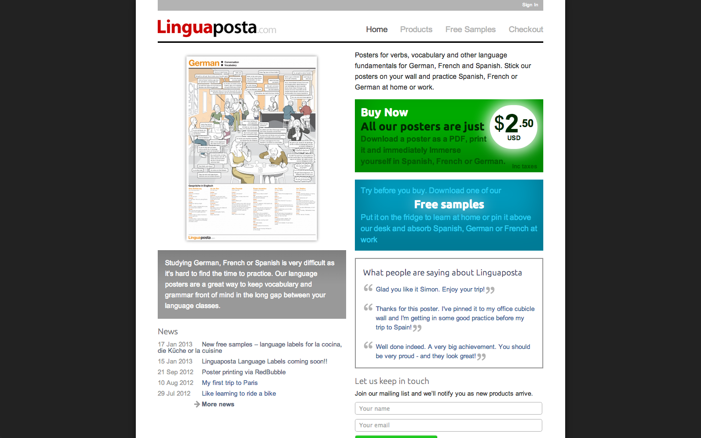
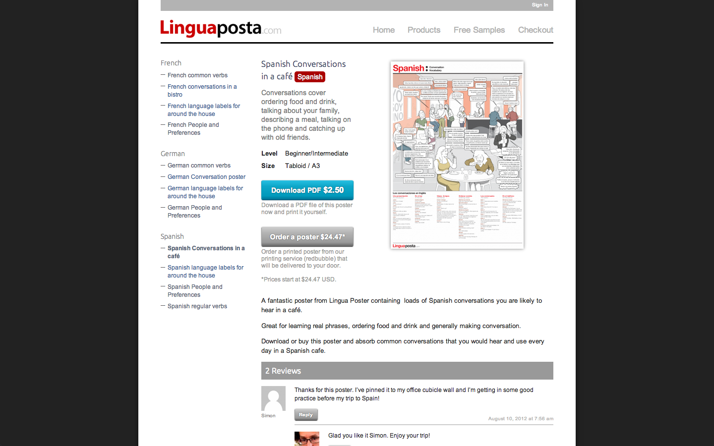

Almost as soon as I started working in Product Management, seeing products from inception through a full market lifecycle I knew that one day I would like to try and apply this practice to a product of my own creation. As a spanish language student I knew that the available support materials were a few and far between and of a fairly low and unexciting standard. I sensed that their was an opportunity to merge my design skills and web development expertise to create a viable language product that didn't, well, suck.

### The approach

As self funded operators without the usual checks and balances supplied by financial stakeholders I recognised that it would be quite easy for us to let the process slip and act on whims and fancies. Therefore I probably adhered more strictly to business development processes by conducting extensive market research, testing product ideas and prototypes on my fellow language students and analysing the business case

### The result

[Linguaposta.com](http://linguaposta.com) launched in August 2012 and has been growing steadily since that time. Feedback from our customers has been quite positive and has led us to explore new product ideas and provide alternate methods of product delivery. We are also exploring potential partnership options with other language learning organisations. We continue to run a lean operation and so consider our decisions and manoeuvres carefully.

 

 
