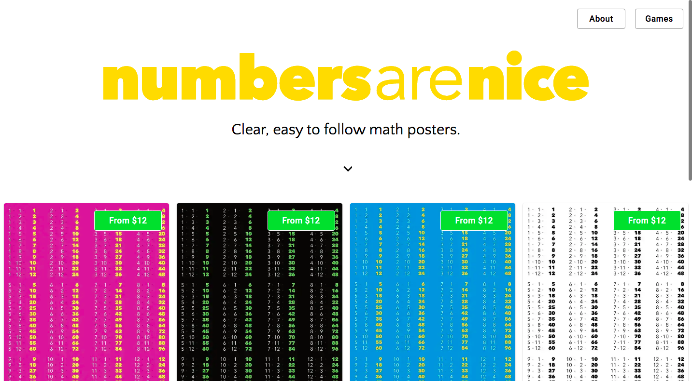

I'm actually quite bad at Maths. I blame my friends from high school who were much more interesting to joke around with than to listen to our teacher drone on. But every now and then as a technical person you find it comes in handy.

My primary school age child also has a bit of anti-maths bias. So while I had some time on my hands I decided to start a new project, called [Numbers are nice](https://numbersarenice.com), creating maths posters and games. It follows a similar model to my long running [language poster site](https://linguaposta.com). I make posters, people buy them if they like them. 

However with this one as it's partially aimed at kids, I thought it would be good to add some games.

To start with, the site is very simple. I've just created some multiplication tables posters and a times table speed game. That's the part of Maths that my offspring is currently striuggling with. As they grow into more challenging areas of Maths, I'll come up with visual ideas to make the new concepts clear.

It was fun making a site that was highly relevant to my little family member. They were my main tester, and it's nice to share what I do with them. Their biggest piece of feedback - it needs a scoreboard Dad! So I added one - cheating a bit and storing the data in localhost, but they were happy.
